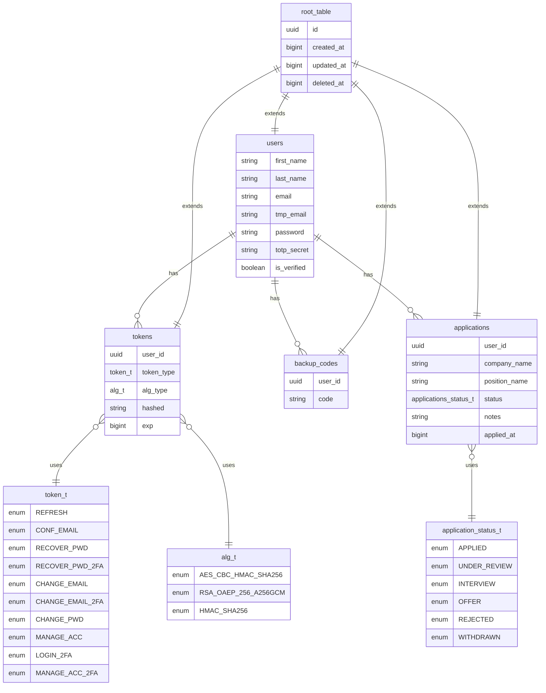

# ASP JOB APPLICATION TRACKER 📈

## 📌 About This Project

This app was inspired by my own job search journey. I started by tracking applications in a notepad, but quickly realized I needed something more structured.

The first version was built with **Next.js** on the frontend and **Python** on the backend. Later, I rebuilt the backend in **Java**, focusing on scalability and cleaner API design while keeping the **Next.js** client.

Now, I’m rebuilding the client in **Angular**, and with the backend already developed and tested, I can focus entirely on the interface.

---

## 🧱 Tech Stack

The name **ASP** comes from the core stack that powers the project:

- **A** => **Angular** for building the client interface
- **S** => **Spring Boot** for the backend logic and API layer
- **P** => **PostgreSQL** for handling data persistence and storage

Together they form a clean, modern **full-stack architecture** 🚀

---

### 🖥️ **Client**

- **Angular 20** — Zoneless frontend framework with SSR support and Signals for fine-grained reactivity
- **TypeScript** — A typed superset of JavaScript for safer, maintainable code
- **RxJS** — Reactive programming library for handling asynchronous data streams
- **NgRx (Store + Effects)** — Predictable global state management and side-effect handling built on **RxJS**
- **Angular Forms + Zod** — Reactive form handling with schema-based, type-safe validation
- **Angular HTTPClient** — Built-in HTTP module with interceptors for secure API integration
- **Tailwind CSS** + **Sass** — Utility-first CSS with extended support for custom and complex designs
- **Motionone** — Modern animation library for the DOM with concise syntax similar to **Framer Motion** (React)
- **svg_ng_cli** — Custom **Python** CLI tool that parses SVG files into Angular components with dynamic color and size bindings

---

### 💾 **Server**

- **Java 21** — Primary backend language
- **Spring Boot (WebFlux)** — Reactive, non-blocking backend framework powered by an **event-loop** execution model
- **Project Reactor** — Core reactive foundation powering **WebFlux**, **R2DBC**, and **Redis** for fully non-blocking data flows
- **PostgreSQL + R2DBC** — Asynchronous database access with reactive drivers
- **Liquibase** — Database migrations, written in raw SQL for full control
- **Redis (Lettuce)** — Async/reactive Redis client for caching and real-time data
- **Cloudinary (Reactive WebClient)** — Manually integrated using Spring’s WebClient, enabling fully non-blocking image and video uploads
- **JavaMailSender (MimeMessage)**— For sending HTML email content, including transactional emails built with custom, hand-crafted templates for full control over design and layout
- **java_pkg_cli** — Custom **Python** CLI utility to automatically add dependencies to both the **TOML catalog** and **Gradle build file**, eliminating repetitive hardcoding and improving consistency in dependency management

---

### 🧪 **Testing & Quality**

- **Playwright** — End-to-end testing for UI flows
- **Vitest** — Unit testing for the client
- **JUnit Jupiter** — Unit and integration testing for the backend
- **Postman** — API testing
- **Checkstyle, SpotBugs, PMD** — Static analysis and code quality enforcement for Java

---

### 🛠️ **DevOps & Deployment**

- **Turborepo** — Monorepo project structure for managing client and server together, with coordinated scripts and parallel builds
- **Docker** — Ensures consistent environments for development and production across both client and server
- **Docker Hub** — Publishing and managing images
- **Kind** — Run local Kubernetes clusters for development
- **GitHub Actions** — Automated pipelines for testing, building, and deploying both apps
- **Fly.io** — Hosting platform (client and server deployed as separate services)
- **Supabase** — PostgreSQL hosting
- **Upstash** — Hosting platform for Redis
- **Brevo (SMTP)** — Outbound transactional email delivery
- **Zoho Mail** — Inbound email hosting for custom domain addresses
- **Namecheap** — Domain provider, configured with DNS records (SPF, DKIM, DMARC) to support both Brevo + Zoho
- **Zsh** — Custom shell scripts for scaffolding and developer productivity
- **sync_env_cli** — Custom **Python** CLI tool that synchronizes environment variables across the client and server directories, updates **Kubernetes** secrets, and patches environment variables in the Git-based **CI/CD pipeline** for deployment.

---

## 📦 Setup

After cloning the repository, start by installing the dependencies:

```bash
yarn install && yarn install_pkg
```

This will initialize the project and install all required packages for both client and server.

---

### 🔒 Environment Variables

All required environment variables are listed in:

[`apps/server/app/src/main/resources/application.yml`](apps/server/app/src/main/resources/application.yml)

This file not only configures the server but also declares the environment variables required by the application.

- **Main runtime** variables are grouped under the top-level key **app**.

- **Mail service** settings are located under **spring.mail**.

- **Database connection** settings are under **spring.r2dbc**.

- **💡Note**:
  The same variables must also be present in a **kind-secrets.yml** file (not committed to git). This file is required if you want to run the app in a local **Kubernetes cluster** via **Kind**.
  A template for this file looks like:

  ```bash
  apiVersion: v1
  kind: Secret
  metadata:
  name: asp-job-application-tracker
  type: Opaque
  stringData:
  APP_NAME: "asp-job-application-tracker"
  ...rest key value pairs variables
  ```

---

### 📜 Scripts

To streamline development, I created a set of helper scripts located in the [**scripts**](scripts) folder.  
They are written in **Zsh**, so you can either copy them into your **.zshrc** file or place them wherever you normally keep custom scripts.

---

### 🛠️ Build & Run

To start a development session, run:

```bash
yarn dev
```

This command uses **Turborepo** to run both the **Java server** and the **Angular client** in parallel:

- ☕ **Java** runs at [http://localhost:3000](http://localhost:3000)
- 🟦 **Angular** runs at [http://localhost:3001](http://localhost:3001)

---

To build the app, run:

```bash
yarn build
```

This triggers **Turborepo** to build both the client and server in parallel:

- ☕ **Java** Compiles to bytecode and produces a `.jar` file at [apps/server/app/build/libs/server-1.0.0.jar](apps/server/app/build/libs/server-1.0.0.jar)
- 🟦 **Angular** Runs the Angular build pipeline and generates output according to the rendering configuration defined in [apps/client/src/app/app.routes.server.ts](apps/client/src/app/app.routes.server.ts)

---

Once the build is complete, you can start servers with:

```bash
yarn start
```

This again uses **Turborepo** to launch both the **Java server** and the **Next.js client** in parallel:

- ☕ **Python** runs at [http://localhost:3000](http://localhost:3000)
- 🟦 **Angular** is served at [http://localhost:3001](http://localhost:3001)

---

### 🐋 Docker

#### 🛠️ Build

To build the **client** Docker image, run:

```bash
dbc
```

---

To build the **server** Docker image, run:

```bash
dbs
```

---

#### 🐳 Start

To start a container:

- **Server**

```bash
dsi 0
```

- **Client**

```bash
dsi 1
```

---

#### 🔗 Result

- 🟦 **Angular** is packaged into a Docker image and served from a container at [http://localhost:3001](http://localhost:3001)
- ☕ **Java** compile to bytecode and the generated **.jar** file is run inside a container at [http://localhost:3000/api/v1](http://localhost:3000/api/v1)

---

### 🔀 Nginx Reverse Proxy

To mirror the production setup, I use an **Nginx reverse proxy** that listens on port **443 (HTTPS)** and routes requests to the correct service:

- In **development**:

  - ☕ Server => port **3000**
  - 🟦 Client => port **3001**

- In **Kubernetes**:
  - ☕ Server => port **30080**
  - 🟦 Client => port **30081**

This setup provides a **single HTTPS entrypoint** while internally forwarding traffic to the right service.  
It also avoids the need for a separate `kind` mode (like `ENV_M0DE=kind`) — Nginx handles all routing automatically.

Configuration files can be found at [nginx](nginx)

---

#### 🔄 Switching Between Environments

Instead of hardcoding routes, the last line **include /etc/nginx/env/active.conf** in the [nginx/nginx.conf](nginx/nginx.conf) file acts as an entrypoint for environment-specific configs.

The script [`ngx`](scripts/nginx/ngx) in **scripts/nginx** manages a **symlink** (active.conf) that points to the right environment file:

- **Development** => /etc/nginx/env/dev.conf
- **Kubernetes** => /etc/nginx/env/kind.conf

---

##### 🛠️ Development config

Running

```bash
ngx
```

Activates dev.conf

---

##### 💾 Kind config

Running

```bash
ngx k
```

Activates kind.conf

---

### 🚢 Kubernetes

To start a local **Kubernetes Cluster** run

```bash
kcc
```

The script present in [scripts/kind.zsh](scripts/kind.zsh) will

- **Create the cluster** using **Kind** passing the config file at repo root
- **Apply secrets** defined in **kind-secrets.yml**
- **Deploy the applications** using the manifests located in:

  - [`apps/client/kind-deploy.yml`](apps/client/kind-deploy.yml)
  - [`apps/client/kind-service.yml`](apps/client/kind-service.yml)
  - [`apps/server/kind-deploy.yml`](apps/server/kind-deploy.yml)
  - [`apps/server/kind-service.yml`](apps/server/kind-service.yml)

#### 🔗 Access

- **Client** => available at **[http://localhost:30081](http://localhost:30081)**
- **Server** => available at **[http://localhost:30080](http://localhost:30080)**

If you’ve set up the **Nginx reverse proxy** (see section above), it will automatically route these internal ports behind a single HTTPS entrypoint (port 443).

---

### ⚗️ Testing & Type Checking & Code Quality

#### ✒️ Type Checking & Code Quality

- **Client**: Formatting with **ESLint** • Type checking with **TypeScript**
- **Server**:
  - Code style enforcement with **Checkstyle**
  - Code quality checks with **PMD**
  - Bug detection with **SpotBugs**

Run:

```bash
yarn check
```

---

#### 🧪 Tests

If your development environment uses **HTTPS** (via Nginx or another proxy), you’ll need an additional set of environment variables for testing.

---

Running every test with `ng serve` directly can be slow and flaky due to rebuild times.  
To improve stability and speed, the recommended workflow is:

1. **Build** the app

   ```bash
   yarn build:test
   ```

2. **Start** both client & server

   ```bash
   yarn start
   ```

3. **Run tests** in parallel for both client & server, using the maximum number of workers available on your machine:

   ```bash
   yarn tests
   ```

---

##### 🟧 Postman testing

A ready-to-use **Postman setup** is available at the root of the repo in the **postman directory**:

- [TEST_API.postman_collection.json](/postman/TEST_API.postman_collection.json) — Contains all API request
- [ENV_VAR.postman_environment.json](postman/ENV_VAR.postman_environment.json) — Contains the required environment variables
- [scripts](/postman/scripts/) — Contains reusable scripts used during testing to improve **efficiency**

---

## 🐘 PostgreSQL Tables Shape



---

## 🛠️ CI/CD

The pipeline is defined in [`GitHub Workflows`](.github/workflows/check_deploy.yml) and runs automatically on every push to the **main** branch.

### 🚧 Workflow Stages

1. **Lint & Type Checking**

   - Runs `yarn check` to validate both client and server code.

2. **Tests**

   - Run `yarn test` for both client and server to ensure code quality and prevent regression.

3. **Deployment to Fly.io**

   - Client and server are hosted separately, each with its own Dockerfile.
   - **Server** is built and deployed first, ensuring it’s available for any API requests during client build.
   - **Client** is then built and deployed. Static pages that rely on API data can safely query the newly deployed server.

---

This way it:

- Ensures **zero broken builds** reach production.
- Keeps **frontend and backend deployments independent** but coordinated.
- Automates the whole dev => deploy cycle with minimal manual intervention.

---

## ⚙️ Python CLI Tools

### 📂 Working Directory

Each CLI tool can be executed directly from its relative project directory:

- **Java package manager CLI:** [`apps/server/java_pkg_cli`](apps/server/java_pkg_cli)
- **SVG parser CLI:** [`apps/client/svg_ng_cli`](apps/client/svg_ng_cli)
- **Env sync CLI:** [`sync_env_cli`](sync_env_cli)

Alternatively, you can use helper shell scripts to run the tools from anywhere without changing directories:

- 📦 **ja** => located at [`scripts/java.zsh`](scripts/java.zsh)
- 🎨 **ngcv** => located at [`scripts/svg.zsh`](scripts/svg.zsh)
- 🔐 **ue** => located at [`scripts/env.zsh`](scripts/env.zsh)

> All scripts execute in a **subshell**, so your current terminal directory remains unchanged after they finish.

---

### 🔋 Installation

To install project dependencies run:

```bash
poetry install
```

This will automatically create a virtual environment and install all dependencies defined in `pyproject.toml`.

---

### 🛠️ Build

To build the Python package, use:

```bash
poetry build
```

This command generates two distribution files inside the `dist/` folder:

- **Wheel (`.whl`)** — a prebuilt installable package
- **Source tarball (`.tar.gz`)** — a gzipped archive of your source code

---

### 📦 Local Installation

To install the built wheel into your **local Poetry environment** (not globally or in the system environment):

```bash
poetry run pip install dist/java_pkg_cli-1.0.0-py3-none-any.whl
```

---

### 🚀 Running the CLIs

#### 🔐 sync_env_cli

Run the Env Sync CLI to update all .env files(root, client, server), patch GitHub Actions workflows, and sync Kubernetes secrets:

```bash
poetry run python -m sync_env_cli env_mode
```

Example:

```bash
poetry run python -m sync_env_cli d
```

- **💡 Note**:
  For every patched file, a backup is created with a `.bkp` suffix.
  Example: `check_deploy.yml` => `check_deploy.yml.bkp`

##### 🔧 Parameters

| Parameter    | Description                                                  | Example                                                    |
| ------------ | ------------------------------------------------------------ | ---------------------------------------------------------- |
| **env mode** | Required — determines which environment configuration to use | `d` => development<br>`p` => production<br>`t` => test<br> |

---

#### 🧰 java_pkg_cli

Run the Java package manager CLI using:

```bash
poetry run python -m java_pkg_cli group:artifact:version i
```

Example:

```bash
poetry run python -m java_pkg_cli example_group:example_artifact:1.2.3-cool_version_released i
```

##### 🔧 Parameters

| Parameter       | Description                                                              | Example                                                                  |
| --------------- | ------------------------------------------------------------------------ | ------------------------------------------------------------------------ |
| **library**     | Required — Gradle dependency in `group:artifact:optional-version` format | `io.projectreactor:reactor-core:3.6.6`                                   |
| **config type** | Optional — Gradle configuration type (`i` by default)                    | `i` => implementation<br>`tr` => testRuntimeOnly<br>...and more via `-h` |

Show all options:

```bash
poetry run python -m java_pkg_cli -h
```

---

#### 🎨 svg_ng_cli

Run the SVG parser CLI using:

```bash
poetry run python -m svg_ng_cli path_to_svg_file output_folder_path [svg_type]
```

##### 🔧 Parameters

| Parameter              | Description                                                 | Example                                                           |
| ---------------------- | ----------------------------------------------------------- | ----------------------------------------------------------------- |
| **SVG file path**      | Required — path to the input `.svg` file                    | `assets/icons/user.svg`                                           |
| **Output folder path** | Required — folder where parsed components will be generated | `src/app/icons/`                                                  |
| **SVG type**           | Optional — determines how the SVG should be processed       | `f` => fill<br>`s` => stroke<br>`a` => advanced _(default: fill)_ |

---

### 🧠 Summary

| CLI              | Purpose                                 | Location                                             | Shortcut |
| ---------------- | --------------------------------------- | ---------------------------------------------------- | -------- |
| **java_pkg_cli** | Generate Gradle dependency snippets     | [apps/server/java_pkg_cli](apps/server/java_pkg_cli) | `ja`     |
| **svg_ng_cli**   | Convert SVGs into Angular components    | [apps/client/svg_ng_cli](apps/client/svg_ng_cli)     | `ngcv`   |
| **sync_env_cli** | Update .env files, Git and Kind secrets | [sync_env_cli](sync_env_cli)                         | `ue`     |

---

## 🪾 Branches & Commits

When looking at the **Git history**, you’ll notice a recurring pattern where each entry shows the **branch name** followed by an arrow **=>** and then the **commit message**.

For example:

```bash
🪾 recover_pwd_2FA_backup_code => 🛠️ validated endpoint
```

This is the convention I follow to make it obvious which branch the work came from. That way, even after I **merge** and **delete** a branch, its commits still carry a **clear trace** of their **origin**.

For clarity, I also configure Git to always create a **merge commit** (**no fast-forward** merges).
This ensures that the history explicitly shows where a branch **forked off** and where it was **merged back in**.
This makes the development process easier to follow because you can see the **“passages”** of **each feature** or fix across the **project timeline**

---

### 📑 Emoji Legend

- **⚠️ Critical** => local build works, but errors appear at **deploy** / **CI/CD**

- **📜 Docs** => documentation updates

- **🐛 Bugfix** => fixes for reported issues or errors

- **🔥 New** => new features

- **🎨 Refactor** => code cleanups / restructuring without changing behavior

- **🧪 Tests** => adding or improving test coverage

- **🛠️ Default** => normal workflow / maintenance

For example:

```bash
🪾 recover_pwd_2FA_backup_code => 🐛 fix backup_code validation

🪾 sql_root_table => 🎨 refactor method to_d to parse bytes as hex

🪾 main => 📜 updated project readme
```

I find that this style makes the **Git history** much easier to **scan quickly** and to **search** by **commit type**

---

## ✏️ Final Notes

I hope you find the project interesting — if not, the app doesn’t come with a refund policy 💰

Thanks for checking out the repo ✌🏼
